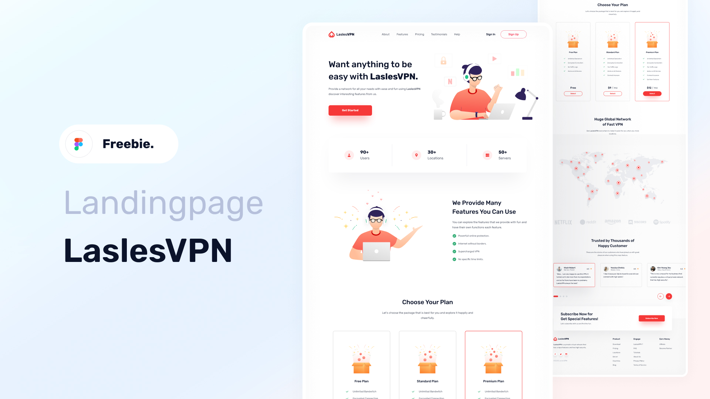

<h1 align="center"> SupportVPN </h1>

Landingpage da SupportVPN - Serviços de VPN.

  <a href="#🚀-tecnologias">Tecnologias</a>&nbsp;&nbsp;&nbsp;|&nbsp;&nbsp;&nbsp;
  <a href="#💻-projeto">Projeto</a>&nbsp;&nbsp;&nbsp;|&nbsp;&nbsp;&nbsp;
  <a href="#🔖-layout">Layout</a>&nbsp;&nbsp;&nbsp;|&nbsp;&nbsp;&nbsp;
  <a href="#memo-licença">Licença</a>

 

  

## 🚀 Tecnologias

Esse projeto foi desenvolvido com as seguintes tecnologias:

- HTML e CSS
- JavaScript
- Biblioteca Swipper.Js
- Git e Github
- Figma

## 💻 Projeto

O projeto é uma landingpage dos serviços de VPN que a empresa oferece, mostrando os beneficios de utiliza-los.

## 🔖 Layout

Você pode visualizar o layout do projeto através [DESSE LINK](https://www.figma.com/design/9q4tCHXjG3bryPRSAtYuBb/SD---LandPage---SupportVPN-(Community)?m=auto&t=zeGNS8P8TF2oiSlM-6). É necessário ter conta no [Figma](https://figma.com) para acessá-lo.

## :memo: Licença

Esse projeto está sob a licença MIT.